Tabla de contenidos
- [Proceso de instalación](#proceso-de-instalación)
  - [Instalar Node.js](#instalar-nodejs)
    - [Descargar el Instalador de Windows](#descargar-el-instalador-de-windows)
    - [Comenzar el Proceso de Instalación](#comenzar-el-proceso-de-instalación)
    - [Ejecutar la Instalación de Node.js en Windows](#ejecutar-la-instalación-de-nodejs-en-windows)
  - [Instalar Visual Studio 2022](#instalar-visual-studio-2022)
    - [Descargar el instalador de Windows](#descargar-el-instalador-de-windows-1)
    - [Comenzar el proceso de instalación](#comenzar-el-proceso-de-instalación-1)
  - [Descargar el Frontend y Backend](#descargar-el-frontend-y-backend)
    - [Backend](#backend)
    - [Frontend](#frontend)
  - [Configuración del Frontend](#configuración-del-frontend)
    - [En Visual Studio Code](#en-visual-studio-code)
    - [Ejecutar el programa](#ejecutar-el-programa)
    - [En caso de error al ejecutar](#en-caso-de-error-al-ejecutar)
      - [Ejecutar PowerShell como administrador](#ejecutar-powershell-como-administrador)
      - [Ejecutar el comando](#ejecutar-el-comando)
  - [Configuración del Backend](#configuración-del-backend)
    - [Visual Studio 2022](#visual-studio-2022)

# Proceso de instalación

## Instalar Node.js

### Descargar el Instalador de Windows

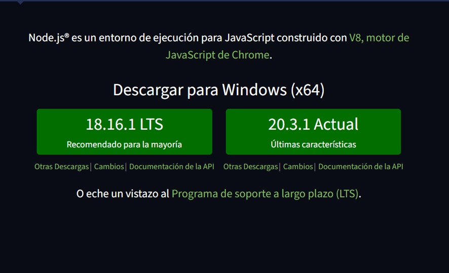

### Comenzar el Proceso de Instalación

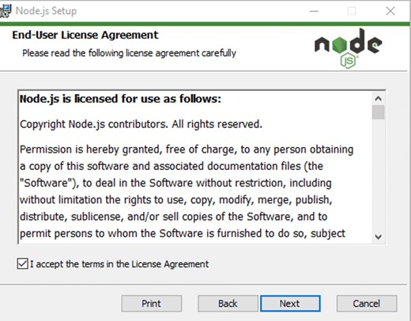

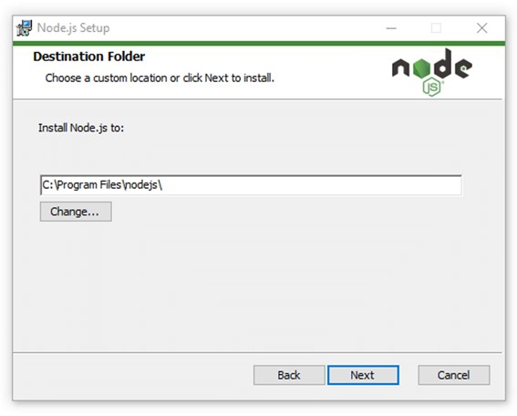

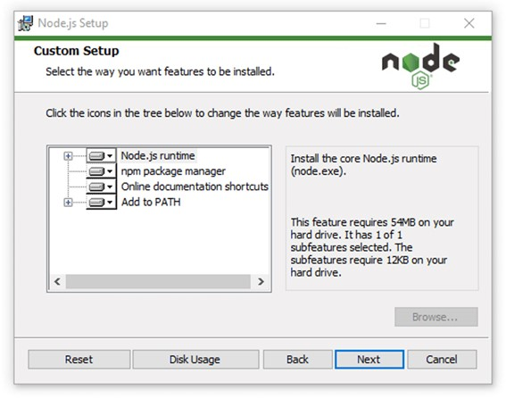

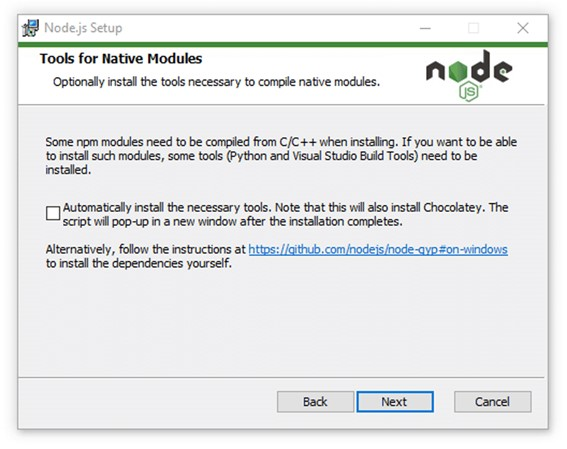

### Ejecutar la Instalación de Node.js en Windows

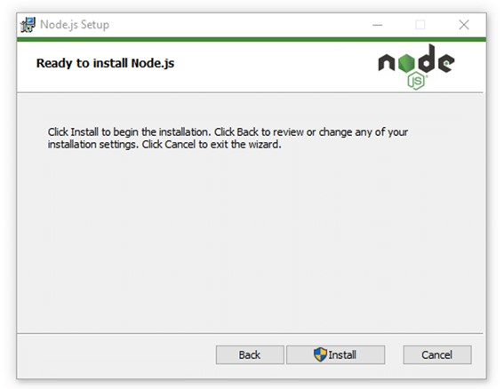

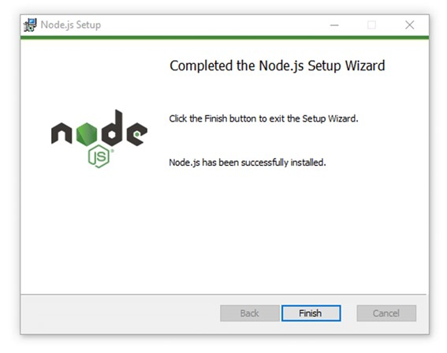

## Instalar Visual Studio 2022

### Descargar el instalador de Windows

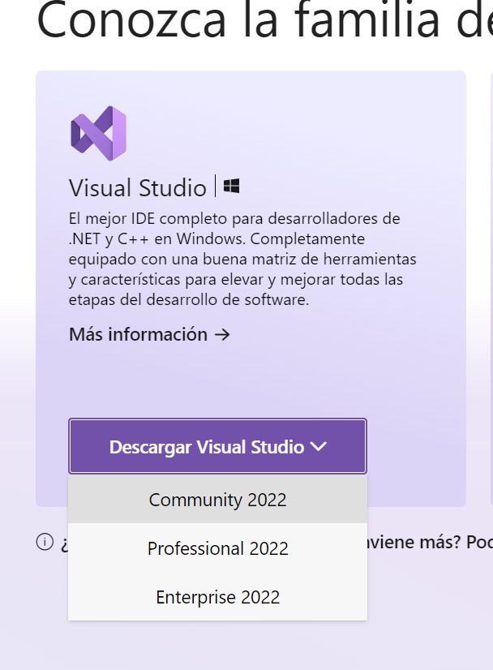

### Comenzar el proceso de instalación

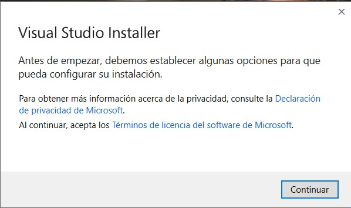

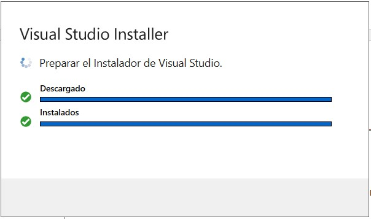

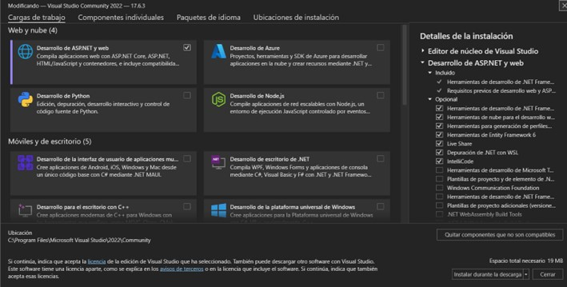

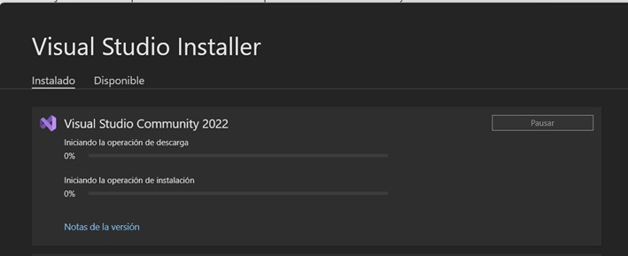

## Descargar el Frontend y Backend
### Backend
[Backend](https://github.com/Nselb/Backend)

Descargar el zip o clonar el repositorio

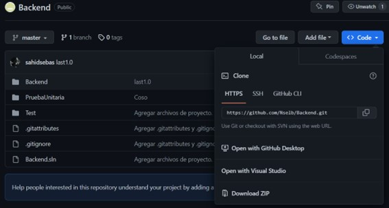

### Frontend
[Frontend](https://github.com/Nselb/Frontend)

Descargar el zip o clonar el repositorio

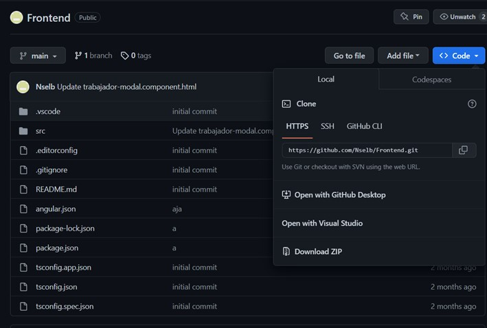

## Configuración del Frontend

### En Visual Studio Code

Al abrir la carpeta en Visual Studio Code, en la terminal ejecutar el comando para instalar los paquetes de node e instalar angular.

    npm i
---
    npm i @angular/cli

### Ejecutar el programa

Una vez instalado todo ejecutar el frontend

    ng serve –open

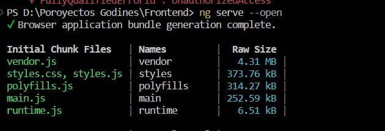

### En caso de error al ejecutar

#### Ejecutar PowerShell como administrador

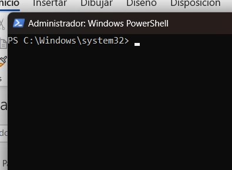

#### Ejecutar el comando

    Set-ExecutionPolicy Unrestricted

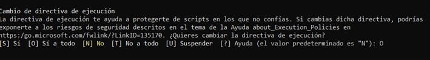

## Configuración del Backend

### Visual Studio 2022

Seleccionar Abrir un proyecto o solución

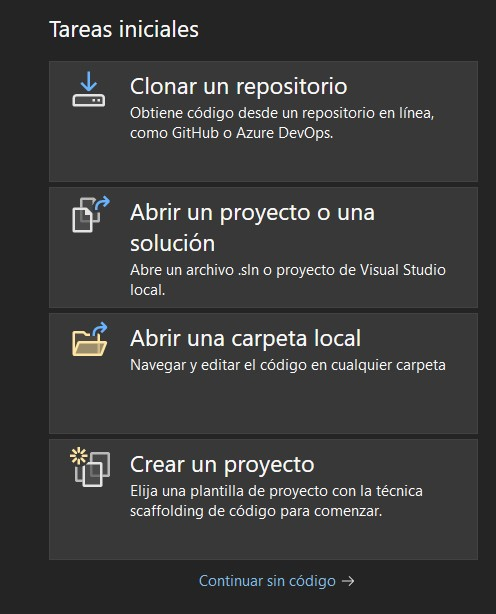

Abrir la solucion descargada o clonada

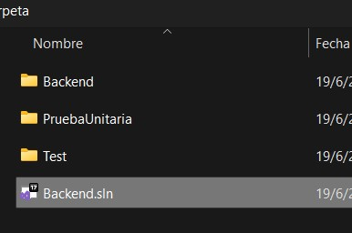

Ejecutar

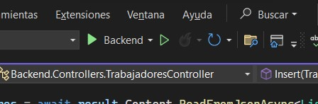

